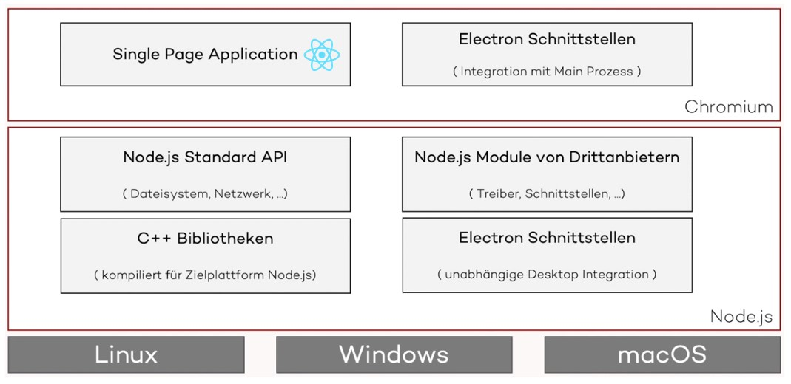
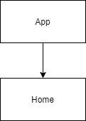
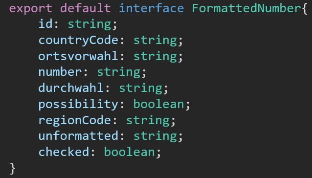

# Design

Der Einsatz der gewählten Technologien beschränkt sich auf den Einsatz der JavaScript Library React.js.
Als Programmiersprache wird auf TypeScript gesetzt um neben Standardfunktionalitäten von JavaScript noch Vorteile wie Typisierung in 
der Entwicklung nutzen zu können. 
Neben React wird Electron als Framework zur Umwandlung der Web App zu einer PWA ("Progressive Web App") gesetzt.

Der Aufbau der React Anwendung selber setzt neben der App Komponente lediglich 
eine weitere Komponente vorraus. Dieser Sachverhalt ist zur Verdeutlichung in der 
nachfolgenden Grafik festgehalten: 

Während die App Komponente Aufgaben wie das Routing übernimmt, ist die 
Home Komponente für die Darstellung des Ausgabefeldes und der Anzeige des Ergebnisses zuständig. 
Die Entscheidung, die Anwendung nicht weiter zu Granularisieren, wurde aus Zeitgründen getroffen. 

Die genaue Strukturierung des geparsten Telefonnummer Objektes in einzelne Attribute wurde in den UserStorys bereits angedeutet und wird in etwa das folgende Format besitzen: 

