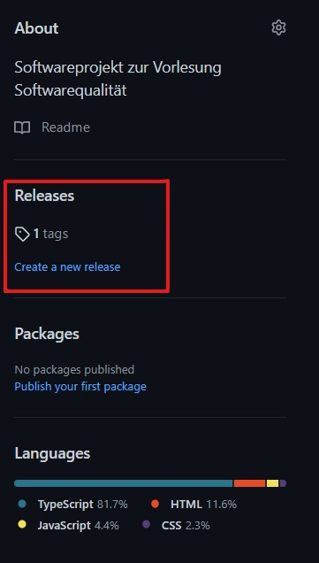
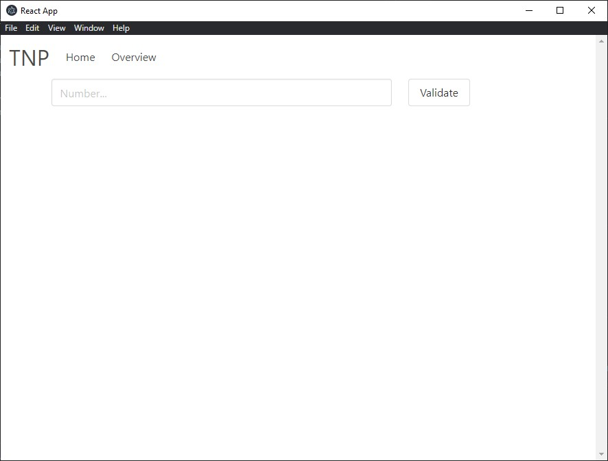

# Release Dokumentation 

Die Software wird im Release Abschnitt des Github Repository bereit gestellt.

Die Releases richten sich nach dem Konzept der "semantic versioning":
* Beispiel: MAJOR.MINOR.PATCH
* MAJOR version when you make incompatible API changes,
* MINOR version when you add functionality in a backwards compatible manner, and
* PATCH version when you make backwards compatible bug fixes.

Für das Ausführen des Projektes muss lediglich die Setup.exe installiert werden.
Anschließend wird die Anwendung installiert und kann ausgeführt werden.

